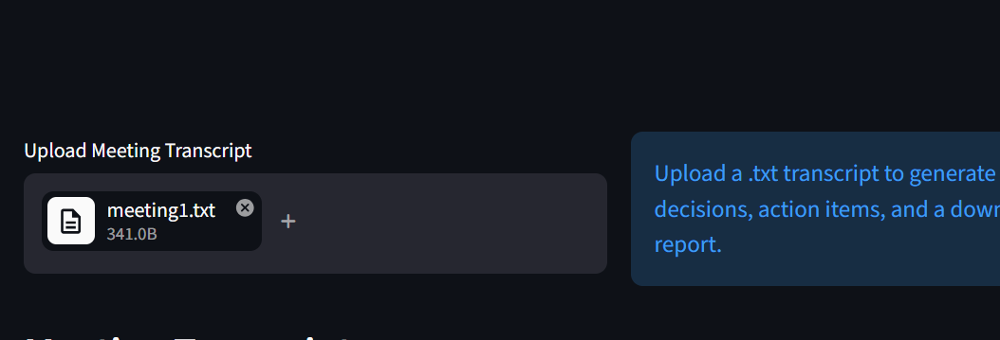
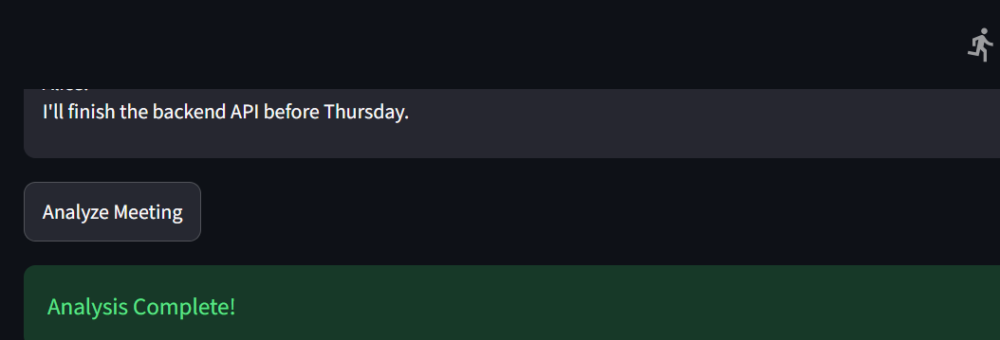
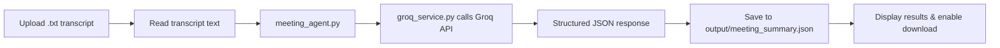

# AI Meeting Notes Agent

> Turn any plain-text meeting transcript into a clean summary, key decisions, and action items — powered by [Groq](https://groq.com/).

---

## Screenshots

| Home / Upload | Results |
|---|---|
|  |  |

---

## About

**AI Meeting Notes Agent** is a full-stack AI app with two interfaces:

- **Streamlit** — local desktop-style UI for quick analysis (`streamlit_app.py`)
- **FastAPI** — production-ready web interface deployable on Vercel (`app.py`)

Upload a `.txt` meeting transcript, and the agent calls the Groq API to extract a structured JSON report containing:

- 📝 Meeting Summary
- ✅ Key Decisions
- 📋 Action Items

The result is displayed in the UI and can be downloaded as `meeting_summary.json`.

---

## How It Works



1. Upload a `.txt` meeting transcript via the UI.
2. The transcript is passed to `agents/meeting_agent.py`, which builds the prompt using `prompts.py`.
3. `services/groq_service.py` sends the prompt to Groq and returns raw JSON.
4. The app parses the JSON and displays the **Summary**, **Key Decisions**, and **Action Items**.
5. The result is saved to `output/meeting_summary.json` and offered as a download.

---

## Features

- 📂 Upload `.txt` meeting transcripts
- 🤖 AI-powered summarization via Groq
- 🗝️ Key decision extraction
- ✅ Action item extraction with owner & due date
- 💾 Auto-save structured JSON to `output/`
- ⬇️ One-click JSON download
- 🖥️ Streamlit UI for local use
- 🌐 FastAPI + dark-mode web UI for cloud deployment

---

## Tech Stack

| Layer | Technology |
|---|---|
| AI / LLM | [Groq API](https://groq.com/) (`groq` SDK) |
| Local UI | [Streamlit](https://streamlit.io/) |
| Web / API | [FastAPI](https://fastapi.tiangolo.com/) + Uvicorn |
| Language | Python 3.10+ |
| Config | `python-dotenv` |
| Deployment | [Vercel](https://vercel.com/) |

---

## Project Structure

```
meeting_agent/
├── agents/
│   └── meeting_agent.py        # Core agent — builds prompt & calls Groq
├── data/
│   ├── meeting1.txt            # Sample transcripts
│   ├── meeting2.txt
│   ├── meeting3.txt
│   ├── client_meeting.txt
│   └── scrum_meeting.txt
├── output/                     # Generated JSON reports (git-ignored)
├── screenshots/                # UI screenshots used in README
├── services/
│   └── groq_service.py         # Groq API wrapper
├── tests/                      # Test suite
├── app.py                      # FastAPI app (Vercel entrypoint)
├── streamlit_app.py            # Streamlit app (local)
├── config.py                   # App configuration
├── prompts.py                  # System prompt for the agent
├── utils.py                    # Helper utilities (e.g. save_json)
├── requirements.txt
├── .env.example
└── .gitignore
```

---

## Prerequisites

- Python **3.10** or above
- A **Groq API key** — get one free at [console.groq.com/keys](https://console.groq.com/keys)
- Internet connection

---

## Setup

### 1. Clone the repository

```bash
git clone https://github.com/saisanket232/meeting-notes-ai-agent.git
cd meeting-notes-ai-agent
```

### 2. Create a virtual environment

**Windows**
```bash
python -m venv venv
venv\Scripts\activate
```

**macOS / Linux**
```bash
python3 -m venv venv
source venv/bin/activate
```

### 3. Install dependencies

```bash
pip install -r requirements.txt
```

### 4. Configure environment variables

Create a `.env` file in the project root:

```bash
cp .env.example .env
```

Then open `.env` and add your key:

```env
GROQ_API_KEY=your_groq_api_key_here
```

### 5. Run the application

#### Streamlit (local UI)

```bash
streamlit run streamlit_app.py
```

Open [http://localhost:8501](http://localhost:8501) in your browser.

#### FastAPI (local API server)

```bash
uvicorn app:app --reload
```

Open [http://localhost:8000](http://localhost:8000) in your browser.

---

## Vercel Deployment

The `app.py` FastAPI app is the Vercel entrypoint.

1. Push the repository to GitHub.
2. Import the project into [Vercel](https://vercel.com/new).
3. Add the environment variable `GROQ_API_KEY` in **Settings → Environment Variables**.
4. Deploy — Vercel will detect `app.py` automatically.
5. Open the deployed URL, upload a `.txt` transcript, and click **Analyze Meeting**.

---

## Sample Files

The `data/` folder includes ready-to-use sample transcripts:

| File | Description |
|---|---|
| `meeting1.txt` | General team meeting |
| `meeting2.txt` | Project planning session |
| `meeting3.txt` | Retrospective |
| `client_meeting.txt` | Client call |
| `scrum_meeting.txt` | Daily scrum standup |

---

## Future Improvements

- [ ] PDF and DOCX transcript support
- [ ] Email delivery of the summary report
- [ ] Google Calendar / Outlook integration
- [ ] Multi-language transcript support
- [ ] Speaker-aware action item attribution
- [ ] Persistent history of past meeting analyses
