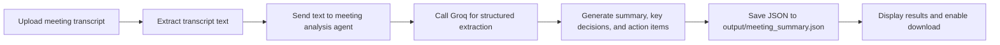

# AI Meeting Notes Agent

AI Meeting Notes Agent is a Streamlit app that turns a meeting transcript into a clean summary, key decisions, action items, and a downloadable JSON report.

## Screenshots


## App URL

Local URL: [http://localhost:8501](http://localhost:8501)

## How It Works

The app follows a waterflow-style pipeline:



1. You upload a `.txt` meeting transcript in the Streamlit interface.
2. The transcript text is passed to the meeting analysis agent.
3. The agent calls Groq to extract the important meeting details.
4. Groq returns structured JSON with the summary, key decisions, and action items.
5. The app shows the results on the page and saves them to `output/meeting_summary.json`.
6. You can download the final JSON report from the UI.

In short, the app moves meeting notes through a sequence of stages like flowing water: upload, analyze, structure, save, and download.

## Features

- Upload `.txt` meeting transcripts
- AI summarization
- Key decision extraction
- Action item extraction
- JSON download
- Streamlit UI

## Prerequisites

- Python 3.10 or above
- Groq API key
- Internet connection

## Tech Stack

- Python
- Streamlit
- Groq API
- JSON

## Project Structure

```
meeting_agent/
├── agents/
│   └── meeting_agent.py
├── data/
│   ├── meeting1.txt
│   ├── meeting2.txt
│   ├── meeting3.txt
│   ├── client_meeting.txt
│   └── scrum_meeting.txt
├── output/
├── screenshots/
├── services/
│   └── groq_service.py
├── streamlit_app.py
├── config.py
├── prompts.py
├── requirements.txt
├── tests/
└── utils.py
```

## Setup

### 1. Clone the repository

```bash
git clone https://github.com/saisanket232/meeting-notes-ai-agent.git
cd meeting-notes-ai-agent
```

### 2. Create a virtual environment

#### Windows

```bash
python -m venv venv
venv\Scripts\activate
```

#### macOS/Linux

```bash
python3 -m venv venv
source venv/bin/activate
```

### 3. Install dependencies

```bash
pip install -r requirements.txt
```

### 4. Create a `.env` file

Create a file named `.env` in the project root and add:

```text
GROQ_API_KEY=your_groq_api_key_here
```

Get your API key from [Groq Console](https://console.groq.com/keys).

### 5. Run the application

```bash
streamlit run streamlit_app.py
```

The app opens at [http://localhost:8501](http://localhost:8501).

## Sample Files

The `data/` folder contains sample meeting transcripts:

- `meeting1.txt`
- `meeting2.txt`
- `meeting3.txt`
- `client_meeting.txt`
- `scrum_meeting.txt`

Use any of these files to test the workflow quickly.

## Future Improvements

- PDF support
- DOCX support
- Email integration
- Calendar integration
